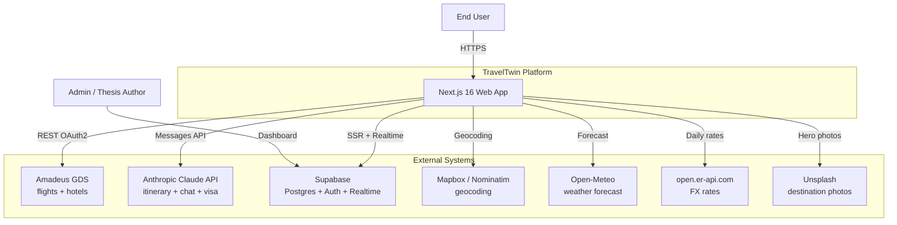
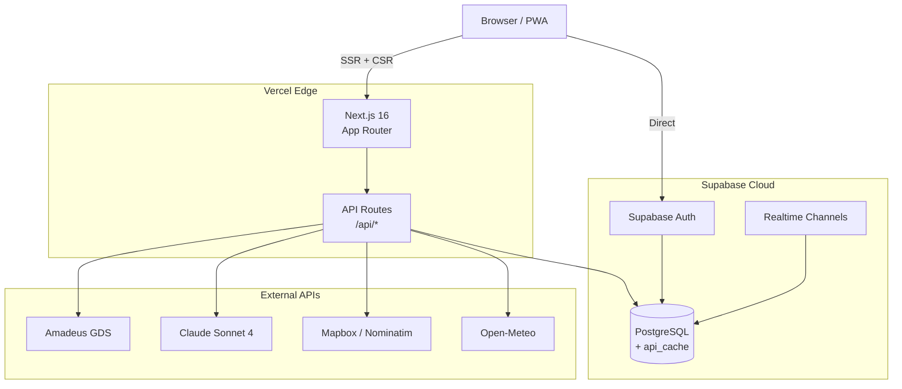
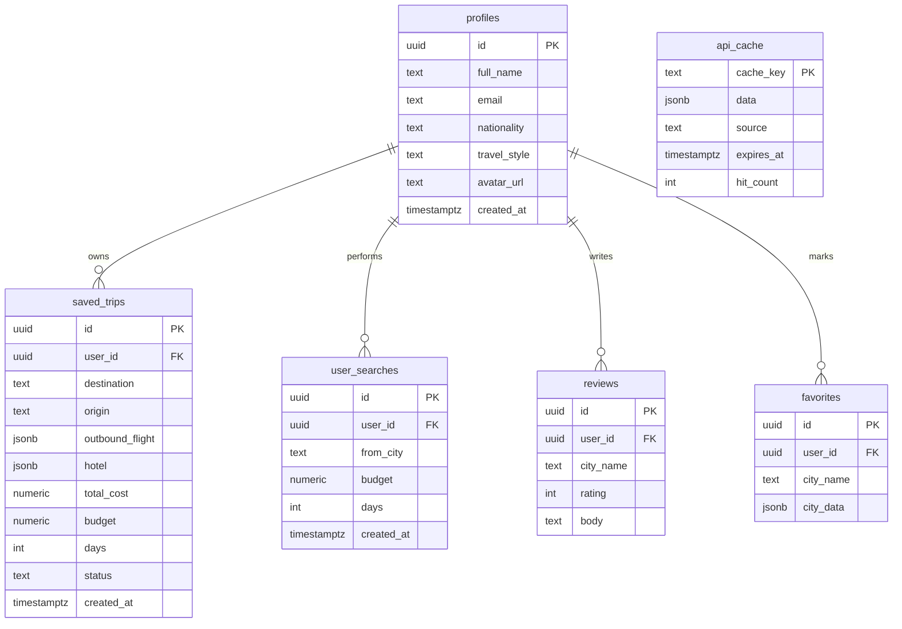
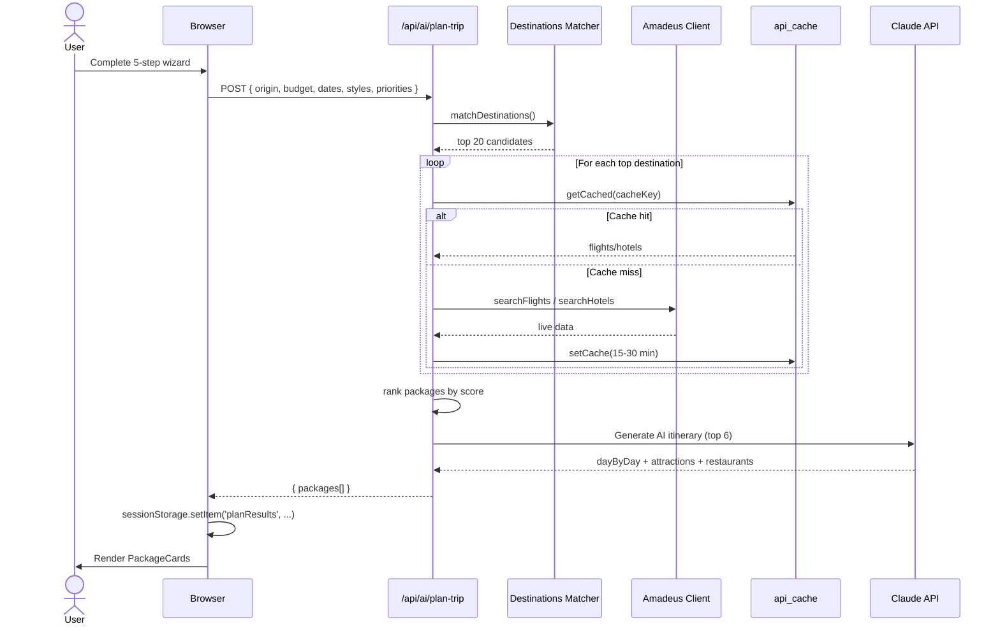
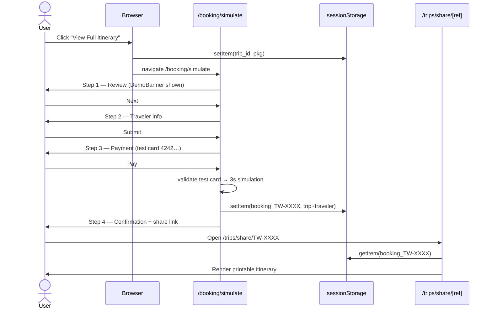
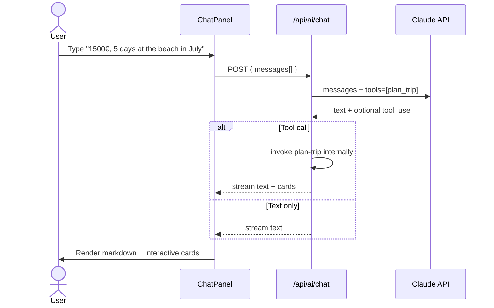
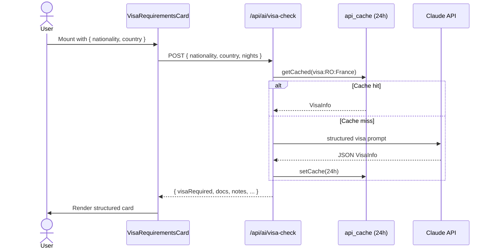

# TravelTwin — Architecture Reference

> All diagrams use [Mermaid](https://mermaid.js.org). GitHub renders them inline.

## C4 — System Context

## C4 — Container Diagram

## ER Diagram — Supabase

## Sequence — User plans a trip

## Sequence — User books (simulated)

## Sequence — AI Chat (existing ChatPanel)

## Sequence — Visa check

## Caching strategy

| Layer | Where | TTL | Purpose |
|-------|-------|-----|---------|
| Browser | localStorage | 1h | FX rates |
| Browser | sessionStorage | session | Plan results, current trip |
| API | `api_cache` table | 15min | Flights (Amadeus) |
| API | `api_cache` table | 30min | Hotels (Amadeus) |
| API | `api_cache` table | 24h | Locations (IATA autocomplete) |
| API | `api_cache` table | 24h | Visa check (Claude) |
| API | `api_cache` table | 3h | Weather (Open-Meteo) |
| Edge | Vercel CDN | revalidate=10800 | Open-Meteo fetch |
| In-memory | `geocodeCache` Map | per session | Nominatim results |

## Error handling philosophy

- Amadeus errors → 4xx surface as "no results, try different dates"; 5xx surface as "try again later".
- Claude errors → fall back to deterministic template content (no broken UI).
- Open-Meteo / FX errors → use static fallback snapshot (lib has hard-coded values).
- Cache write failures → silently ignored (cache is best-effort).
